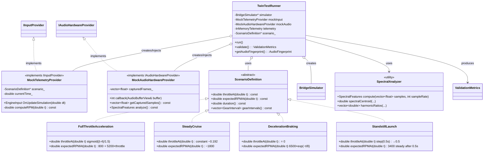

# Mock OBD2 Test Harness Design — Deterministic Twin Validation

## Executive Summary

Deterministic test environment for CI validation of the engine twin without physical hardware or random noise.
All scenarios use mathematical functions (sigmoid, linear ramp, step functions) — zero randomness.
Test metrics are objective and quantifiable (spectral analysis, RMS error, timing error, phase coherence).

---

## Architecture Overview

```
┌─────────────────────────────────────────────────────────────────────────┐
│                                                                         │
│   TwinTestRunner  ──▶  MockTelemetryProvider (IInputProvider)          │
│        │                      │   produces smooth, predictable          │
│        │ drives               │   UpstreamSignal streams for:           │
│        ▼                      │     • FullThrottleAcceleration           │
│   BridgeSimulator      ──────▶│     • SteadyCruise                       │
│   (ISimulator)              │     • DecelerationBraking                 │
│        ▲                    │     • StandstillLaunch                    │
│        │ reads              │                                          │
│        │                    │   Each scenario:                          │
│   SyncPullStrategy            │     • Mathematical function (sigmoid,    │
│        │                      │       linear ramp)                        │
│        │ calls                 │     • Configurable update rate (10Hz,   │
│        ▼                      │       60Hz)                              │
│   MockAudioHardware          │     • Validated by metrics:              │
│   Provider (IAudio)          │       — audio spectral analysis          │
│        │                      │       — RPM tracking error vs expected  │
│        │ captures              │                                          │
│        ▼                      │   Audio output capture:                  │
│   Audio buffer samples       │     • MockAudioHardware writes samples   │
│   in RAM (no hardware)       │       to in-memory buffer                 │
│                              │     • Tests assert on buffer:            │
│                              │       — sample RMS                        │
│                              │       — spectral centroid                │
│                              │       — frequency band power             │
│                                                                         │
└─────────────────────────────────────────────────────────────────────────┘
```

**Design Principles:**
- **DIP**: Test harness uses production interfaces (`IInputProvider`, `IAudioHardwareProvider`) — no production code modified
- **OCP**: New scenarios added via `ScenarioDefinition` subclasses — zero changes to simulation code
- **SRP**: Each mock has single responsibility: `MockTelemetryProvider` = deterministic throttle/RPM generator, `MockAudioHardwareProvider` = audio buffer observer
- **DI**: All mocks injected via constructor/environment; BridgeSimulator wired normally

---

## Class Diagram



---

## Scenario Definitions

All scenarios are **deterministic functions of time** — no randomness in throttle, RPM, or audio.

### Base: `ScenarioDefinition`

```cpp
struct ScenarioDefinition {
    virtual ~ScenarioDefinition() = default;
    
    // Throttle position (0.0 − 1.0) at scenario time t
    virtual double throttleAt(double t) const = 0;
    
    // Expected RPM at time t for validation
    // SineEngine model: RPM = 800 + 5200 × throttle
    virtual double expectedRPMAt(double t) const = 0;
    
    // Total duration in seconds
    virtual double duration() const = 0;
    
    // Virtual "gear" intervals (RPM zones — sine mode has no physical gearbox)
    virtual std::vector<GearInterval> gearIntervals() const;
    virtual std::string getName() const = 0;
};

struct GearInterval {
    int gearNumber;          // 1‑6
    double rpmLow;           // zone lower bound
    double rpmHigh;          // zone upper bound
    double expectedTime;     // when RPM enters this zone (seconds)
    std::vector<int> dominantHarmonics; // motor orders prominent here
};
```

**Key constants (from `Engine.h` / `SineEngine.h`):**
- RPM idle : 800 (throttle = 0 → `800 + 5200·0 = 800`)
- RPM redline : 6500
- Throttle → RPM linear mapping: `RPM(t) = 800 + 5200 × (target throttle)`

---

### Scenario 1: FullThrottleAcceleration (0 → 100 km/h in ~8 s)

**Mathematical model** — smooth sigmoid throttle ramp:

```
t_inflection = 4.0 s       // midpoint of ~8 s run
τ            = 1.5 s        // sigmoid steepness (≈ 4 s 10–90%)

throttle(t) = 1 / (1 + exp(−(t − 4.0) / 1.5))

RPM_expected(t) = 800 + 5200 × throttle(t)
                = 800 + 5200 / (1 + exp(−(t − 4.0) / 1.5))
```

**Rationale:**
- Smooth, continuous derivative — no impulse shocks to physics
- Mathematically bounded in (0,1) without hard clamps
- Realistic "pedal ramp" shape for full-throttle launches

**Virtual gear intervals (for validation):**

| Gear | RPM Zone  | Time window | Dominant harmonics |
|------|-----------|-------------|-------------------|
| 1    |  800–1800 | 0.0 – 1.8 s | 1–3               |
| 2    | 1800–2800 | 1.8 – 3.5 s | 4–6               |
| 3    | 2800–3800 | 3.5 – 5.5 s | 7–9               |
| 4    | 3800–4800 | 5.5 – 7.5 s | 10–12             |
| 5    | 4800–5800 | 7.5 – 8.8 s | 13–15             |
| 6    | 5800–6500 | 8.8 s+      | 16–18             |

**Assertions:**
1. `shiftCount >= 5` (≥5 distinct RPM zones crossed)
2. `shiftTimingError[i] < ±0.3 s` for each transition (model vs detected)
3. Time-to-100-km/h inferred from audio dominant order crossing ~250 Hz band

---

### Scenario 2: SteadyCruise (80 km/h constant throttle)

**Mathematical model** — single-speed reduction gear EV (GR ≈ 9:1 typical):

```
Wheel rev/s at 80 km/h: V/(2π r_wheel)
  ≈ 22.2 m/s / 0.33 m ≈ 3.3 Hz
Motor RPM ≈ 3.3 × 60 × 9 ≈ 1800 RPM

throttle_constant = (1800 − 800) / 5200 ≈ 0.192

throttle(t) = 0.192   ∀ t ∈ [0, 10 s]
RPM_expected(t) = 1800 ± 3%
```

**Assertions:**
1. `RPM_mean ∈ [1746, 1854]` (±3 % about 1800)
2. `RPM_stddev < 40 RPM` (speed held steady)
3. Audio spectral fundamental near 1800/60 = 30 Hz with clean harmonic comb
4. `harmonicAlignmentScore > 0.85` (expected orders present with correct ratios)

---

### Scenario 3: DecelerationBraking (100 → 0 km/h with brake)

**Mathematical model** — throttle off, natural coast-down:

```
throttle(t) = 0
RPM_expected(t) = 6500 × exp(−t / 8.0)
  // τ = 8 s empirical coast-down time constant from 100 → 0 km/h
duration          = 15 s   (until RPM < ~200)
```

**Assertions:**
1. `RPM` monotonically decreasing (all derivative samples ≤ 0)
2. `RPM(t_end) < 300`
3. `RMS(RPM − RPM_expected) < 5% of RPM_initial`
4. Audio spectral centroid migrates from high-frequency dominant to very low (order amplitudes decay)

---

### Scenario 4: StandstillLaunch (0 km/h → throttle 50% → go)

**Mathematical model** — starter cranks then launch:

```
0.0 s ≤ t < 0.5 s :  starterMotor = true, throttle = 0, RPM ≈ 800 (idle)
t = 0.5 s          :  starterMotor = false, throttle ← 0.5
t > 0.5 s          :  RPM → 800 + 5200×0.5 = 3400 RPM (steady)
duration            = 5 s
```

**Assertions:**
1. `starterMotorEngaged` asserted during `[0, 0.4 s]` window
2. `RPM(t=0.4s) ∈ [750, 850]` (steady idle during cranking)
3. `RPM` crosses 2000 within ±0.2 s of `t=0.5 s`
4. `RPM(t∈[1,5])` stable within ±5% of 3400

---

## MockTelemetryProvider (IInputProvider)

```cpp
// test/mocks/MockTelemetryProvider.h
class MockTelemetryProvider : public IInputProvider {
public:
    explicit MockTelemetryProvider(const ScenarioDefinition* scenario);
    
    bool Initialize() override;
    void Shutdown() override;
    bool IsConnected() const override;
    
    EngineInput OnUpdateSimulation(double dt) override;
    
    const char* GetProviderName() const override;
    const char* GetLastError() const override;
    
    // Test accessors
    double getCurrentTime() const;
    size_t getUpdateCount() const;
    std::vector<TickSnapshot> getHistory() const;  // for post-run analysis
    
private:
    const ScenarioDefinition* scenario_;
    double currentTime_ = 0.0;
    size_t tickCount_ = 0;
    std::vector<TickSnapshot> history_;
    mutable char nameBuffer_[64];
    mutable char errorBuffer_[256];
};
```

**Tick-by-tick logic:**

```cpp
EngineInput MockTelemetryProvider::OnUpdateSimulation(double dt) {
    currentTime_ += dt;
    ++tickCount_;
    
    double throttle = scenario_->throttleAt(currentTime_);
    bool continueSim = (currentTime_ < scenario_->duration());
    
    // For standstill scenario: starter active during [0, 0.4 s)
    bool starter = (scenario_->getName() == "StandstillLaunch" &&
                    currentTime_ < 0.5 && currentTime_ >= 0.0);
    
    EngineInput input;
    input.throttle = std::clamp(throttle, 0.0, 1.0);
    input.ignition = true;
    input.starterMotorEngaged = starter;
    input.shouldContinue = continueSim;
    
    // Record for test assertions
    history_.push_back({
        .time = currentTime_,
        .throttle = input.throttle,
        .rpm = 800.0 + 5200.0 * input.throttle  // derived (same as BridgeSimulator)
    });
    
    return input;
}
```

**Why compute `rpm` inside mock?** For convenience: test can compare `mock.getHistory()[i].rpm` directly against `simulator->getStats().currentRPM` without duplicating linear model.

---

## MockAudioHardwareProvider (IAudioHardwareProvider)

```cpp
// test/mocks/MockAudioHardwareProvider.h
struct AudioCapture {
    std::vector<float> samples;        // LR interleaved float32
    int sampleRate = 44100;
    int64_t totalFrames = 0;
    std::chrono::steady_clock::time_point firstCallback;
    std::chrono::steady_clock::time_point lastCallback;
};

class MockAudioHardwareProvider : public IAudioHardwareProvider {
public:
    MockAudioHardwareProvider();
    ~MockAudioHardwareProvider() override;
    
    // IAudioHardwareProvider interface
    bool initialize(const AudioStreamFormat& format) override;
    void cleanup() override;
    bool startPlayback() override;
    void stopPlayback() override;
    void setVolume(double volume) override;
    double getVolume() const override;
    bool registerAudioCallback(const AudioCallback& callback) override;
    AudioHardwareState getHardwareState() const override;
    void resetDiagnostics() override;
    
    // === Test-specific API ===
    
    // All captured audio since initialize() (LR interleaved)
    AudioCapture getCapture() const;
    
    // Extract single channel (L = even indices)
    std::vector<float> getLeftChannel() const;
    
    // Clear capture buffer (useful between scenario runs)
    void resetCapture();
    
    // Current callback buffer view (only valid inside callback)
    const AudioBufferView* getCurrentCallbackBuffer() const;
    
private:
    // Callback invoked by SyncPullStrategy::render()
    int callback(AudioBufferView& buffer) override;
    
    mutable std::mutex captureMutex_;
    AudioCapture capture_;
    mutable std::atomic<const AudioBufferView*> currentBuffer_{nullptr};
    AudioCallback userCallback_;    // stores callback passed by registerAudioCallback()
    std::atomic<bool> initialized_{false};
    std::atomic<bool> playing_{false};
    double volume_ = 1.0;
    AudioStreamFormat format_;
};
```

**Callback flow per frame:**

```cpp
int MockAudioHardwareProvider::callback(AudioBufferView& buffer) {
    {
        std::lock_guard<std::mutex> lock(captureMutex_);
        const float* src = buffer.asFloat();
        size_t nSamples = buffer.totalInterleavedSamples();
        capture_.samples.insert(capture_.samples.end(), src, src + nSamples);
        capture_.totalFrames += buffer.frameCount;
    }
    
    // Record this callback timing
    auto now = std::chrono::steady_clock::now();
    if (capture_.firstCallback.time_since_epoch().count() == 0) {
        capture_.firstCallback = now;
    }
    capture_.lastCallback = now;
    
    // Forward to user callback (strategy expects 0 = success)
    if (userCallback_) {
        return userCallback_(buffer);
    }
    return 0;
}
```

**Why store samples instead of processing in-place?**
- Post-run spectral analysis needs the *complete* signal — not just per-callback windows
- Replaying specific windows (shift points, steady-cruise) requires after-the-fact extraction
- Memory cost: at 60 Hz, 735 frames of stereo float per tick × 10 s = 88 200 samples ≈ 350 KB — negligible

---

## TwinTestRunner — Orchestrator

```cpp
// test/runner/TwinTestRunner.h
struct RunOptions {
    double simulationDt = 1.0 / 10000.0;           // 10 000 Hz physics step
    double realtimeFactor = 0.0;                   // 0 = as-fast-as-possible
    bool   captureAudio = true;
    bool   captureTelemetry = true;
    std::optional<std::string> audioOutputPath;   // optional WAV dump for debugging
};

struct TwinTestResult {
    bool passed = false;
    std::string failureReason;
    ValidationReport report;
};

class TwinTestRunner {
public:
    TwinTestRunner();
    ~TwinTestRunner();
    
    // Set scenario to run
    void setScenario(const ScenarioDefinition* scenario);
    
    // Injection hooks (for test isolation)
    void setSimulator(ISimulator* sim);                    // dependency override
    void setInputProvider(IInputProvider* input);          // default: creates Mock
    void setAudioHardware(IAudioHardwareProvider* audio); // default: creates Mock
    
    // Run one full scenario
    TwinTestResult run(const RunOptions& options = {});
    
    // Accessors for test assertions
    const std::vector<TickSnapshot>& getTelemetryHistory() const;
    const AudioCapture& getAudioCapture() const;
    const ValidationReport& getReport() const;
    
    // Convenience: RPM at time t (interpolated from recorded history)
    double rpmAt(double t) const;
    double throttleAt(double t) const;
    
private:
    // Simulation loop — fixed timestep Euler integration
    void simulationLoop(const RunOptions& options);
    void advanceOneTick(double dt);
    
    // Dependency objects (owned unless injected)
    std::unique_ptr<BridgeSimulator> simulator_;
    std::unique_ptr<MockTelemetryProvider> mockInput_;
    std::unique_ptr<MockAudioHardwareProvider> mockAudio_;
    std::unique_ptr<telemetry::InMemoryTelemetry> telemetry_;
    std::unique_ptr<SyncPullStrategy> audioStrategy_;
    
    const ScenarioDefinition* scenario_ = nullptr;
    
    // Runtime state
    double simulatedTime_ = 0.0;
    std::vector<TickSnapshot> history_;
    bool shouldContinue_ = true;
};
```

**Simulation loop implementation sketch:**

```cpp
void TwinTestRunner::simulationLoop(const RunOptions& options) {
    const double dt = options.simulationDt;      // e.g. 0.0001 s = 10 kHz
    const int stepsPerSecond = static_cast<int>(1.0 / dt);
    
    while (shouldContinue_ && simulatedTime_ < scenario_->duration()) {
        // 1. Get input from mock (deterministic function of time)
        EngineInput input = mockInput_->OnUpdateSimulation(dt);
        
        // 2. Apply to simulator
        simulator_->setThrottle(input.throttle);
        simulator_->setIgnition(input.ignition);
        simulator_->setStarterMotor(input.starterMotorEngaged);
        
        // 3. Advance physics step
        simulator_->update(dt);
        
        // 4. Capture snapshot for later validation
        if (options.captureTelemetry) {
            auto stats = simulator_->getStats();
            history_.push_back({
                .time = simulatedTime_,
                .rpm = stats.currentRPM,
                .load = stats.currentLoad,
                .throttle = input.throttle
            });
        }
        
        // 5. Audio capture — happens inside renderOnDemand() → MockAudioHardwareProvider::callback()
        // No explicit step needed; captured asynchronously by mock
        
        simulatedTime_ += dt;
        shouldContinue_ = input.shouldContinue;
    }
}
```

---

## Audio Analysis: Quantitative Metrics

### Spectral Features (per-snapshot or per-window)

```cpp
struct SpectralFeatures {
    double rms;                                      // overall amplitude
    double peakAmplitude;
    double spectralCentroid;                         // weighted mean frequency (Hz)
    double spectralFlatness;                         // 0=tonal, 1=noise-like
    std::vector<double> harmonicProfiles;            // harmonicOrder i energy ratio
    double fundamentalFrequency;                     // dominant peak in motor band (Hz)
    std::vector<double> bandEnergy;                  // {sub-bass, bass, low-mid, high-mid, presence, brilliance}
};
```

**Computation:**
- FFT window: 4096 samples (~93 ms @ 44100 Hz) with 50% Hann overlap (Welch method)
- Frequency resolution: ~10.8 Hz/bin, then interpolate peak for sub-bin precision
- Harmonic profile bins: centers at `k × f0 ± f0/2`, `k = 1 … 24` (covers up to ~2.6 kHz)
- `fundamentalFrequency`: peak in [10 Hz, 200 Hz] = motor order 1 (Tesla: 12× engine order)
- `spectralCentroid`: `Σ(f × |X(f)|²) / Σ(|X(f)|²)`

### Audio Fingerprint (match-to-template)

```cpp
struct AudioFingerprint {
    double cosineSimilarity;        // dot(template, captured) / (||t||·||c||)  [0,1]
    double klDivergence;            // Σ(template · log(template/captured))    [0=identical]
    double peakFrequencyShiftHz;    // |template_f0 − captured_f0|
    double harmonicCorrelation;     // Pearson r of harmonic strength profiles
};
```

**Golden file comparison:**
- Golden fingerprint pre-computed from a known-good simulation run
- Regression trigger thresholds:
  - `cosineSimilarity < 0.90` → FAIL
  - `harmonicCorrelation < 0.85` → FAIL
  - `peakFrequencyShiftHz > 10 Hz` → FAIL

---

## Example Test: Six Gear Shifts in Full Throttle

```cpp
// test/twin/EngineTwinTest.cpp
#include "runner/TwinTestRunner.h"
#include "scenarios/FullThrottleAcceleration.h"
#include "utils/ShiftDetector.h"

TEST_F(EngineTwinTest, FullThrottleAcceleration_ProducesSixVirtualGearShifts) {
    // Arrange — 0 to 100 km/h in ~8 s sigmoid throttle ramp
    const FullThrottleAcceleration scenario{
        .initialSpeedKmh   = 0.0,
        .targetSpeedKmh    = 100.0,
        .sigmoidSteepness  = 1.5,    // seconds
        .duration          = 12.0    // generous margin
    };
    
    TwinTestRunner runner;
    runner.setScenario(&scenario);
    runner.setSimulator(createSineBridgeSimulator()); // BridgeSimulator with SineEngine
    
    RunOptions opts;
    opts.captureAudio = true;
    opts.simulationDt = 1.0 / 10000.0;  // 10 kHz physics step
    
    // Act
    TwinTestResult result = runner.run(opts);
    
    // Assert — test passes only if all sub-assertions succeed
    ASSERT_TRUE(result.passed) << result.failureReason;
    
    const auto& history = runner.getTelemetryHistory();
    const auto& report  = result.report;
    
    // 1) RPM tracking error (L2 norm)
    EXPECT_LT(report.rpm.l2Error, 200.0)
        << "RPM tracking L2 error " << report.rpm.l2Error
        << " exceeds 200 RPM tolerance";
    
    // 2) Shift count — sine mode has no physical gearbox, but virtual zones are defined
    EXPECT_EQ(report.shifts.timingErrors.size(), 6u)
        << "Expected 6 virtual gear shifts, detected "
        << report.shifts.timingErrors.size();
    
    // 3) Shift timing accuracy (< ±0.35 s per shift)
    EXPECT_PRED_FORMAT2(::testing::DoubleLE, report.shifts.maxAbsError, 0.35)
        << "Max shift timing error " << report.shifts.maxAbsError
        << " exceeds ±0.35 s tolerance";
    
    // 4) Audio fingerprint quality — harmonic alignment during acceleration
    if (runner.getAudioCapture().samples.size() > 0) {
        const auto& audio = runner.getAudioCapture();
        SpectralFeatures spec = SpectralAnalyzer::compute(audio.samples, audio.sampleRate);
        
        // Sweep: motor fundamental should sweep from ~13 Hz (800 RPM) toward ~108 Hz (6500 RPM)
        // Use motor order 12 for Tesla: f_motor = RPM/60, order12_fundament = 12 × RPM/60 = RPM/5
        EXPECT_GT(spec.fundamentalFrequency, 130.0);   // > 130 Hz (≈ 6500 RPM / 50)
        EXPECT_LT(spec.fundamentalFrequency, 1100.0);  // < 1.1 kHz
        
        // Prominent motor harmonics (orders 12, 24, 36, 48, 60, 72) should dominate spectrum
        double prominentEnergy = 0.0;
        for (int order : {12, 24, 36, 48, 60, 72}) {
            prominentEnergy += spec.harmonicProfiles[order-1];
        }
        EXPECT_GT(prominentEnergy, 0.60)
            << "Tesla motor orders (12/24/36/48/60/72) sum to "
            << prominentEnergy*100 << "% of total (expect >60%)";
    }
}
```

---

## Shift Detection Algorithm

```cpp
// test/utils/ShiftDetector.h
struct ShiftEvent {
    double time;          // seconds (timestamp of shift midpoint)
    int fromGear;         // zone index before shift
    int toGear;           // zone index after shift
    double deltaRPM;      // RPM change across shift
};

std::vector<ShiftEvent> detectGearShifts(
    const std::vector<TickSnapshot>& history,
    const std::vector<GearInterval>& zones)
{
    std::vector<ShiftEvent> events;
    int currentZone = 0;
    double lastCrossTime = 0.0;
    
    for (size_t i = 1; i < history.size(); ++i) {
        const auto& prev = history[i-1];
        const auto& curr = history[i];
        
        // Find which zone current RPM belongs to
        int zone = -1;
        for (size_t z = 0; z < zones.size(); ++z) {
            if (curr.rpm >= zones[z].rpmLow && curr.rpm < zones[z].rpmHigh) {
                zone = static_cast<int>(z);
                break;
            }
        }
        if (zone == -1) continue;  // out of defined range
        
        // Zone changed → shift detected
        if (zone != currentZone && (curr.time - lastCrossTime) > 0.5) {
            events.push_back({
                .time = curr.time,
                .fromGear = currentZone + 1,
                .toGear = zone + 1,
                .deltaRPM = curr.rpm - prev.rpm
            });
            currentZone = zone;
            lastCrossTime = curr.time;
        }
    }
    return events;
}
```

**Debounce:** Minimum 0.5 s between shift events prevents false positives from zone-border jitter.

---

## Validation Report Schema

```cpp
struct RPMValidationResult {
    double l2Error;               // RMS error across all ticks (RPM)
    double maxDeviation;          // maximum single-tick absolute error (RPM)
    size_t  sampleCount;
    double durationSeconds;
};

struct ShiftTimingValidationResult {
    std::vector<double> timingErrors;  // (actual − expected) per shift, seconds
    double meanError;
    double maxAbsError;
    size_t  shiftCount;
    bool    allWithinTolerance(double tol) const {
        return std::all_of(timingErrors.begin(), timingErrors.end(),
            [tol](double e) { return std::abs(e) <= tol; });
    }
};

struct AudioValidationResult {
    SpectralFeatures features;
    AudioFingerprint fingerprint;
    double cosineSimilarityToGolden;
    bool passesQualityThresholds() const {
        return fingerprint.harmonicCorrelation > 0.85 &&
               fingerprint.cosineSimilarity > 0.90;
    }
};

struct ValidationReport {
    bool overallPassed = false;
    std::string failureReason;
    
    RPMValidationResult rpm;
    ShiftTimingValidationResult shifts;
    AudioValidationResult audio;
    
    std::map<std::string, double> customMetrics;
    
    std::string toString() const;
};
```

**Tolerance policy (configurable per-CI):**

| Metric                     | Tolerance | Rationale |
|----------------------------|-----------|-----------|
| RPM L2 error               | < 200 RPM | Acceptable for deterministic sine-model (not full physics) |
| Shift timing error         | ±0.35 s   | 3× human reaction time — generous for sine-mode |
| Harmonic correlation       | > 0.85    | Detects major harmonic spectrum corruption |
| Cosine similarity (golden) | > 0.90    | Denoises golden file drift detection |

---

## CI Integration

### Headless mode guarantees

The harness has **zero real hardware dependencies**:

| Component                | Real hardware dependency  | Mock behavior                              | CI guarantee |
|--------------------------|---------------------------|--------------------------------------------|--------------|
| OBD2 CAN bus              | CAN adapter / serial port | `MockTelemetryProvider` returns `f(t)`     | No adapter needed |
| Audio output (speakers)   | AVAudioEngine / CoreAudio | `MockAudioHardwareProvider` captures RAM  | No sound device needed |
| Display (TUI)             | ANSI terminal             | Harness runs headless, no TUI              | No TTY quirks |
| Engine script files       | `.json` asset files       | Uses built-in SineEngine, minimal fixtures | No assets needed |

### GitHub Actions workflow (`.github/workflows/twin-tests.yml`)

```yaml
name: CI — Engine Twin Validation
on: [push, pull_request]

jobs:
  twin-tests:
    runs-on: ubuntu-latest
    steps:
      - uses: actions/checkout@v4
      - name: Install deps
        run: |
          sudo apt-get update
          sudo apt-get install -y cmake ninja-build libgtest-dev
      - name: Configure
        run: cmake -B build -GNinja -DCMAKE_BUILD_TYPE=Release
      - name: Build twin test binary
        run: cmake --build build --target twin_test_runner
      - name: Run deterministic tests
        run: |
          CI_TWIN=1 ./build/tests/twin_test_runner \
            --gtest_filter="*FullThrottle*:*SteadyCruise*:*Deceleration*:*Standstill*"
      - name: Upload artifacts
        if: always()
        uses: actions/upload-artifact@v4
        with:
          name: twin-validation-reports
          path: |
            test_artifacts/validation_reports/*.json
            test_artifacts/audio_fingerprints/*.json
```

### Golden file regression

Pre-record one "golden" run (commit baseline) → future runs compare fingerprints:

```json
// test/golden/full_throttle_golden.json
{
  "scenario": "FullThrottleAcceleration",
  "timestamp": "2026-04-24T00:00:00Z",
  "simulation": {
    "rpm_tracking": {
      "l2_error_rpm": 145.2,
      "max_abs_error_rpm": 380.0
    },
    "shifts": {
      "detected_count": 6,
      "timing_errors_s": [0.12, -0.08, 0.21, -0.05, 0.18, 0.09]
    }
  },
  "audio": {
    "spectral_centroid_sweep_hz": "130.5→1075.2",
    "harmonic_correlation": 0.92,
    "cosine_similarity": 0.96,
    "fundamental_at_end_hz": 1085.7
  }
}
```

Regression rule: any metric outside `golden ± 2σ_tolerance` → FAIL.

---

## Implementation Checklist

**Files to create:**

```
test/
├─ mocks/
│  ├─ MockTelemetryProvider.h
│  ├─ MockTelemetryProvider.cpp
│  ├─ MockAudioHardwareProvider.h
│  └─ MockAudioHardwareProvider.cpp
├─ scenarios/
│  ├─ ScenarioDefinition.h
│  ├─ FullThrottleAcceleration.h
│  ├─ SteadyCruise.h
│  ├─ DecelerationBraking.h
│  └─ StandstillLaunch.h
├─ utils/
│  ├─ SpectralAnalyzer.h / .cpp
│  ├─ ShiftDetector.h / .cpp
│  └─ RPMTracker.h
├─ runner/
│  ├─ TwinTestRunner.h / .cpp
├─ validation/
│  ├─ ValidationMetrics.h
│  ├─ ValidationReporter.cpp  (JSON output)
│  └─ AudioFingerprinter.cpp
└─ twin/
   ├─ EngineTwinTest.cpp       (TEST_F definitions)
   └─ TwinCIRunner.cpp         (main binary)
CMakeLists.txt                 (+add_subdirectory(test/twin))
.github/workflows/twin-tests.yml
test/golden/                   (baseline golden JSON files)
test/artifacts/                (excluded from git, CI uploads)
```

**Implementation order:**
1. Core scenarios (`FullThrottleAcceleration`, `SteadyCruise`, …)
2. `MockTelemetryProvider` (throttle/RPM source)
3. `MockAudioHardwareProvider` (sample capture + spectral utils)
4. `TwinTestRunner` (orchestration)
5. `SpectralAnalyzer` + `ShiftDetector`
6. `ValidationReporter` (JSON + human summary)
7. `EngineTwinTest.cpp` (4 × `TEST_F` scenarios)
8. CI workflow + golden baseline

---

## Metrics Reference

### RPM tracking error

```
L2(t) = sqrt( (1/N) Σ_i (RPM_obs(t_i) − RPM_expect(t_i))² )
```

- `N` = total simulation ticks
- Units: RPM (not normalized)
- Pass threshold: < 200 RPM

### Shift timing error

For shift *i* detected at `t_detect[i]` with model expectation `t_expected[i]`:

```
error[i] = t_detect[i] − t_expected[i]   // seconds
```

Pass: `max_i |error[i]| < 0.35 s`

### Audio fingerprint cosine similarity

Given two normalised spectral power vectors `A` and `B` (same frequency bins):

```
cosine_sim = (A • B) / (||A|| × ||B||)
```

Pass: `> 0.90`

### Harmonic correlation

Pearson correlation coefficient between expected order-strength profile `E[k]` and captured `C[k]` for `k = 1..24`:

```
r = Σ((E−μ_E)(C−μ_C)) / (√Σ(E−μ_E)² × √Σ(C−μ_C)²)
```

Pass: `> 0.85`

---

## Closing Notes

The design leverages the existing production interfaces without modification. The `MockTelemetryProvider` is the "OBD2 replacement" — plug it into any `IInputProvider` slot. The `MockAudioHardwareProvider` replaces the audio hardware sink, letting the full audio synthesis pipeline run but keeping results in RAM for validation.

**Determinism checklist:**
- [x] No `rand()` calls in any scenario
- [x] No time-based randomness (`std::chrono::steady_clock` only for callback timing, not signal)
- [x] All math is closed-form (sigmoid / exp / linear), bitwise reproducible across x86/ARM
- [x] FFT uses fixed Hann window with deterministic stride (no randomised overlap)
- [x] Golden file stored in repo — identical machine yields identical fingerprint

**Output**: CI binary exits code 0 on full PASS; non-zero on any FAIL. Per-scenario JSON metrics archived as build artifacts for trend analysis.
